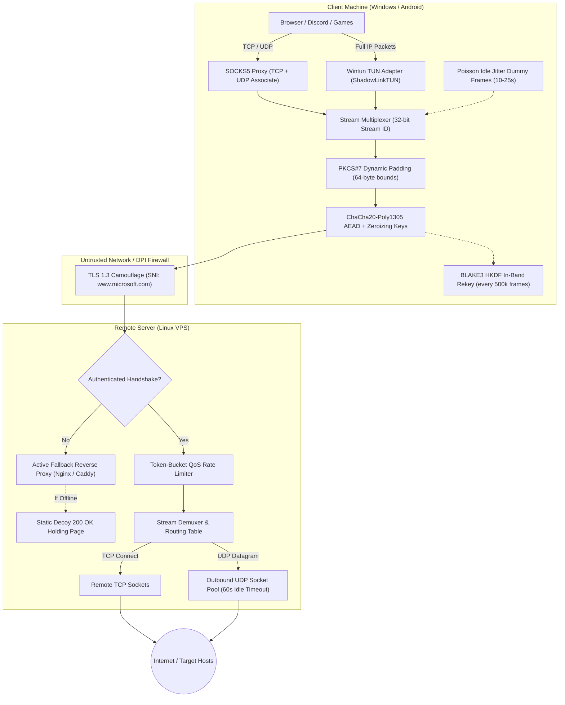
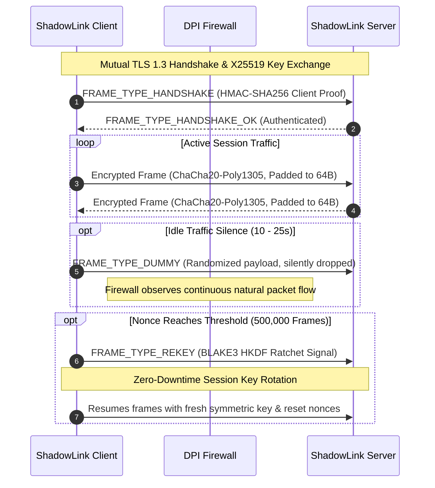

# ⚡ ShadowLink

[](https://github.com/innocous06/shadowlink/actions)
[](https://www.rust-lang.org/)
[](LICENSE)
[](#cross-platform-support)
[](#verification--testing)

> High-performance, memory-safe censorship circumvention proxy and full VPN suite written in Rust.  
> Engineered for DPI evasion, seamless session ratcheting, RFC 1928 UDP proxying, and active probe defense.

---

## 📖 Overview

**ShadowLink** is a modern, self-hosted, enterprise-grade encrypted proxy and VPN ecosystem designed to bypass state-level Deep Packet Inspection (DPI) firewalls (such as the Great Firewall of China, Iran's TIC, and Russia's TSPU).

Unlike legacy tools (Shadowsocks, V2Ray/Xray, Trojan) that suffer from fingerprintable handshakes, predictability in packet lengths, or high CPU runtime overhead, ShadowLink is built from scratch in **Rust** with strict memory safety, zero userspace copying, and cryptographic primitives from the ground up.

---

## 🖥️ Graphical Interface Snapshot

ShadowLink provides a native, GPU-accelerated desktop application built on `egui`/`eframe`:

```text
┌────────────────────────────────────────────────────────────────────────┐
│ ⚡ ShadowLink v2.0.0                      [ Home ]  [ ⚙ Settings ]  [ 📜 Logs ]│
├────────────────────────────────────────────────────────────────────────┤
│                                                                        │
│   [ Connected ] OCI Mumbai (Asia) (01:24:08)                           │
│   Up: 24.8 KB/s    │    Dn: 312.4 KB/s                                 │
│                                                                        │
│ ────────────────────────────────────────────────────────────────────── │
│   Server Selection                                      [ ⟳ Probe Ping ]│
│                                                                        │
│   ● Primary Gateway (127.0.0.1:8443)                           1 ms    │
│   ● OCI Mumbai (Asia) (10.0.0.1:443)                          26 ms  ✔ │
│   ● AWS Frankfurt (EU) (10.0.0.2:443)                         88 ms    │
│   ○ Backup Transit (10.0.0.3:443)                             -- ms    │
│                                                                        │
│ ────────────────────────────────────────────────────────────────────── │
│   Mode:  ( ) SOCKS5 Proxy    (•) Full VPN (Wintun)                     │
│   Kill Switch: [x] Block traffic on disconnect                         │
│                                                                        │
│                    ┌─────────────────────────┐                         │
│                    │     [ Disconnect ]      │                         │
│                    └─────────────────────────┘                         │
└────────────────────────────────────────────────────────────────────────┘
```

---

## 🏗️ Architecture & Tunnel Pipeline



---

## 🔄 In-Band Rekeying & Dummy Jitter Sequence



---

## ✨ Enterprise Feature Matrix

| Category | Feature | Description |
| :--- | :--- | :--- |
| **DPI Evasion** | **Dynamic Traffic Padding** | Frames dynamically padded to 64-byte boundaries, defeating packet size distribution fingerprinting. |
| **DPI Evasion** | **Poisson Idle Jitter** | Injects randomized synthetic dummy frames (`FRAME_TYPE_DUMMY`) during silence to defeat idle correlation. |
| **DPI Evasion** | **Active Web Fallback** | Unauthenticated probes are proxied to a local Nginx/Caddy server, returning genuine HTTP responses. |
| **DPI Evasion** | **TLS 1.3 Camouflage** | Traffic is wrapped in standard TLS 1.3 handshakes presenting authentic SNI headers. |
| **Networking** | **SOCKS5 UDP Associate** | Full RFC 1928 UDP proxying for Discord, Telegram, WebRTC, and online gaming. |
| **Networking** | **Multiplexed Datagrams** | Unlimited TCP streams and UDP datagrams transported over a single encrypted tunnel connection. |
| **Full VPN** | **Windows Wintun Driver** | Kernel-level high-throughput virtual adapter (`ShadowLinkTUN`) via official `wintun.dll` FFI. |
| **Routing** | **Split Tunneling & LAN Bypass** | RFC 1918 subnets (`192.168.0.0/16`, `10.0.0.0/8`, `172.16.0.0/12`) bypass tunnel to physical gateway. |
| **Routing** | **Fail-Safe Route Cleanup** | RAII `RouteGuard` restores original routing tables immediately on shutdown, panic, or crash. |
| **Cryptography** | **In-Band Ratcheting** | Derives new symmetric keys via BLAKE3 HKDF every 500k frames with zero downtime. |
| **Cryptography** | **Zeroized Memory Hygiene** | All private keys and symmetric secrets wrapped in `Zeroizing<T>` to wipe RAM upon deallocation. |
| **Cryptography** | **64-Packet Replay Window** | Bitmask sliding window drops replayed nonces while accepting out-of-order delivery. |
| **Server QoS** | **Token-Bucket Rate Limiter** | Enforces fractional Mbps rate limiting per client session to prevent bandwidth starvation. |
| **Resilience** | **3-Strike Server Failover** | Client automatically rotates across configured server profiles after 3 consecutive failures. |
| **Desktop GUI** | **GPU-Accelerated Interface** | Modern `egui`/`eframe` interface with real-time ping latency probing and throughput meters. |
| **Mobile** | **Android VpnService** | Native Android VPN client written in Kotlin + Jetpack Compose Material 3. |

---

## 🚀 Quick Start

### 1. Generate Cryptographic Keys
```bash
# Compile and run key generator
cargo run --release -p shadowlink-keygen -- both
```
This generates:
- `server.key.json` (encrypted server private key)
- `client.key.json` (encrypted client private key)
- Base64 public keys for client and server.

### 2. Deploy Server (Linux VPS)
Run the automated deployment script on your Linux VPS:
```bash
chmod +x deploy-server.sh
sudo ./deploy-server.sh
```
Or run directly:
```bash
cargo build --release -p shadowlink-server
./target/release/shadowlink-server server-config.toml
```

### 3. Connect Client (Windows)

#### Via Graphical Interface (Recommended):
```bash
cargo run --release -p shadowlink-gui
```
- Select your server profile or click **Probe Ping** to verify latency.
- Choose between **SOCKS5 Proxy** (`127.0.0.1:1080`) or **Full VPN**.
- Click **Connect**.

#### Via Command Line:
```bash
cargo run --release -p shadowlink-client -- client-config.toml
```

---

## ⚙️ Configuration Reference

### Client Configuration (`client-config.toml`)
```toml
server_addr = "YOUR_VPS_IP:443"
sni_hostname = "www.microsoft.com"
socks5_listen = "127.0.0.1:1080"
client_key_path = "client.key.json"
server_public_key = "BASE64_SERVER_PUBLIC_KEY_HERE"
verify_tls_cert = true
enable_logging = true
auto_reconnect = true
reconnect_delay_secs = 3
enable_full_vpn_mode = false
use_inner_encryption = true

# Split Tunneling & LAN Bypass
bypass_lan = true
bypass_routes = ["192.168.1.0/24", "10.0.0.0/8"]

# Multi-Server Redundancy & Failover
[[servers]]
name = "Primary VPS (Mumbai)"
server_addr = "10.0.0.1:443"
sni_hostname = "www.microsoft.com"
server_public_key = "SERVER_PUBKEY_1"

[[servers]]
name = "Secondary VPS (Frankfurt)"
server_addr = "10.0.0.2:443"
sni_hostname = "www.google.com"
server_public_key = "SERVER_PUBKEY_2"
```

### Server Configuration (`server-config.toml`)
```toml
listen_addr = "0.0.0.0:443"
tls_cert_path = "/etc/shadowlink/cert.pem"
tls_key_path = "/etc/shadowlink/key.pem"
server_key_path = "/etc/shadowlink/server.key.json"
allowed_clients = [
    "BASE64_CLIENT_PUBLIC_KEY_HERE"
]
enable_logging = true

# Bandwidth QoS Rate Limiting (in Mbps, optional)
client_rate_limit_mbps = 50.0

# Active Web Server Reverse Proxy Fallback (decoy)
fallback_addr = "127.0.0.1:80"
```

---

## 🧪 Verification & Testing

ShadowLink is thoroughly tested for enterprise reliability:

```bash
# Run all unit and integration tests across the workspace
cargo test --workspace

# Run strict Clippy static analysis with all warnings denied
cargo clippy --workspace -- -D warnings
```

**Test Coverage Summary:**
- `shadowlink-core`: **46 / 46 passing** (Diffie-Hellman, replay window, PKCS#7 padding, key ratcheting, UDP framing, dialer, DNS).
- `e2e_protocol`: **1 / 1 passing** (full end-to-end encrypted session roundtrip).
- Workspace Clippy: **0 errors, 0 warnings**.

---

## 📂 Repository Layout

```text
shadowlink/
├── crates/
│   ├── shadowlink-core/        # Protocol framing, crypto, SOCKS5, dialer, Wintun FFI
│   ├── shadowlink-client/      # Client daemon, failover loop, route management
│   ├── shadowlink-server/      # Multi-client server, QoS rate limiting, web fallback
│   ├── shadowlink-gui/         # Native egui desktop GUI with ping prober
│   └── shadowlink-keygen/      # Key generation and Argon2id passphrase encryption
├── shadowlink-android/         # Kotlin + Jetpack Compose Android app with VpnService
├── certgen/                    # Self-signed X.509 certificate generator utility
├── deploy/                     # Systemd service files and decoy HTML pages
├── deploy-server.sh            # Automated Linux server deployment script
└── tests/                      # End-to-end integration tests
```

---

## 📄 License

This project is licensed under the [MIT License](LICENSE).